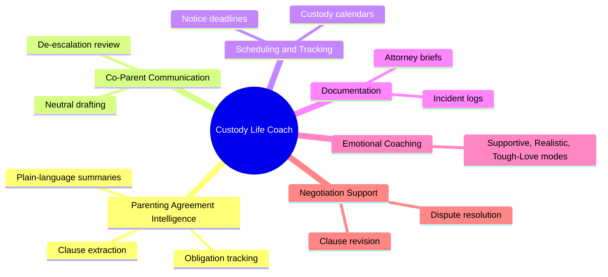
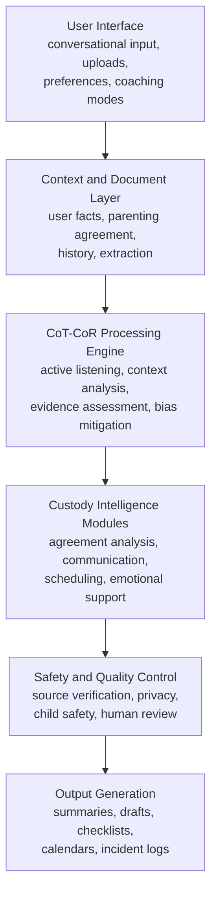
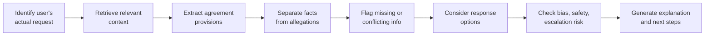
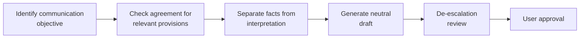
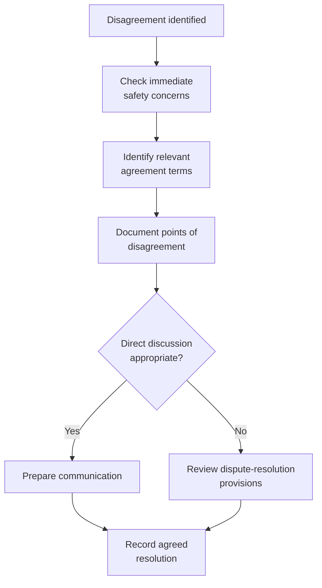

# Custody Life Coach

### AI-Powered Parenting Agreement Intelligence, Custody Preparation, and Life Transition Support

<div align="center">


</div>

A project overview, technical specification, and architecture guide for an AI-powered custody and co-parenting support platform.

## Overview

Custody Life Coach is a specialized AI-powered support system that helps parents navigate child custody arrangements, divorce, co-parenting disputes, parenting agreements, and major family transitions.

It combines structured document analysis, contextual reasoning, emotional intelligence, conflict de-escalation, and practical planning into one assistant, helping parents move from emotionally overwhelming situations toward informed decisions, organized documentation, effective communication, and sustainable parenting practices.

Unlike a general-purpose chatbot, Custody Life Coach is built around the specific challenges of custody proceedings and ongoing co-parenting: reviewing agreements, identifying obligations, preparing communications, organizing custody-related events, and developing strategies for difficult family situations.

Three principles guide the system:

1. **Protect the child**: prioritize safety, stability, emotional well-being, and healthy parental relationships.
2. **Preserve parental dignity and agency**: support informed decisions without encouraging retaliation, manipulation, or unnecessary conflict.
3. **Build long-term stability**: turn complex agreements and family obligations into manageable, sustainable actions.

The project does not replace legal counsel, mental health professionals, mediators, or judicial decision-making. It provides an AI-assisted preparation and organization layer that helps users work with those professionals more effectively.

## The Problem This Solves

Custody disputes involve interconnected challenges that ordinary productivity tools and general-purpose AI assistants rarely address together. A parent may need to interpret a parenting agreement, understand a scheduling conflict, draft an email to the other parent, document an incident, manage stress, and prepare questions for an attorney, all in the same week.

Handled separately, these tasks fragment information, produce inconsistent documentation, cause missed obligations, and can escalate conflict through poorly framed communication.

For example, when one parent requests a last-minute change to a custody exchange, the other parent needs to know: what the agreement actually requires, whether it allows the change, whether advance notice is needed, how the child is affected, and whether the disagreement needs mediation.

Custody Life Coach brings these considerations into one workflow, examining the facts, referencing the applicable agreement, flagging uncertainty, and helping the user reach a constructive next step instead of an emotionally driven response.

## Core Capabilities



## System Architecture

The architecture below is a proposed software implementation of the assistant's behavior, not a claim that every component already exists as an independently deployed service.



Typical interactions: `Create custody coach`, `Analyze parenting agreement`, `Prepare message`, `Draft clause`, `Simulate conversation`, `Create custody schedule`, `Prepare attorney brief`.

Context is kept in three separate categories, never conflated:

| Category | Description |
|---|---|
| Verified document content | Terms explicitly contained in the uploaded agreement or supporting records |
| User-reported information | Events, circumstances, and concerns described by the user |
| AI-generated analysis | Summaries, issue flags, interpretations, and suggested actions |

A user's report of an event is not automatically treated as an independently verified fact, and an AI-generated interpretation is never presented as an official legal determination.

## The CoT-CoR Intelligence Framework

**Context-over-Reasoning (CoR)**: advice is grounded in the parent's actual circumstances rather than generic assumptions. The system tracks what it knows, what the user reported, and what remains uncertain.

**Chain-of-Trust (CoT)**: every recommendation is checked against three questions. Does this protect the child's well-being? Does it preserve the parent's dignity and decision-making autonomy? Does it support a stable, sustainable long-term parenting relationship? This matters most in cases involving threats, coercive behavior, or credible safety concerns, where direct negotiation may not be appropriate.



**Bias mitigation** guards against common reasoning failures in disputes with incomplete or conflicting information:

| Reasoning risk | System response |
|---|---|
| Confirmation bias | Consider whether evidence supports alternative explanations |
| Hasty generalization | Avoid treating one event as proof of a recurring pattern |
| Emotional framing | Separate observed actions from interpretations of intent |
| False dichotomy | Identify options beyond immediate agreement or refusal |
| Unsupported causation | Avoid assuming one event necessarily caused another |

## Parenting Agreement Intelligence

This module converts uploaded parenting agreements into structured information that can be searched, summarized, and used to generate practical workflows.

**Document ingestion** should accept PDF, DOCX, and plain text, extracting content while preserving page numbers, section labels, and source text for each obligation. Scanned documents may need text recognition followed by verification of uncertain text. The system should flag handwritten modifications, missing pages, illegible provisions, and conflicting copies.

**Clause-based analysis** connects findings to specific sections. Example:

```json
{
  "issue_id": "ISSUE-001",
  "category": "Vacation Scheduling",
  "source": {
    "section": "II. VISITATION/TIMESHARE ARRANGEMENTS",
    "subsection": "Vacation Time"
  },
  "extracted_terms": {
    "annual_vacation_weeks": null,
    "notice_days": null,
    "travel_information_days": null
  },
  "issue": "Required notice periods are unspecified.",
  "severity": "Medium",
  "recommended_action": "Confirm the intended notice periods."
}
```

`null` marks information that has not been provided. The system never substitutes an assumed default, so a generic template is never mistaken for a finalized agreement with enforceable deadlines.

Issue severity is an organizational tool, not a judicial determination: **Low** (minor ambiguity, non-urgent clarification), **Medium** (may cause scheduling confusion or disputes), **High** (potential child-safety concern, imminent deadline, or significant unresolved issue).

A complete agreement review generates an executive summary, an overview of custody and decision-making provisions, a description of regular parenting time and holidays, principal issues and ambiguities, a calendar of deadlines, a list of responsibilities per parent, draft alternatives for ambiguous provisions, and questions for attorney review.

## Custody Scheduling and Calendar Intelligence

Agreement terms are converted into practical, date-based obligations. Explicit agreement dates are kept distinct from dates calculated using assumptions, and missing information is flagged before a definitive event is generated.

Example iCalendar output:

```ics
BEGIN:VCALENDAR
VERSION:2.0
PRODID:-//Custody Life Coach//Custody Schedule//EN

BEGIN:VEVENT
UID:example-exchange-001@custody-life-coach
DTSTAMP:20260923T000000Z
DTSTART:20261002T180000
DTEND:20261002T183000
SUMMARY:Example Parenting Exchange
DESCRIPTION:Illustrative event. Confirm against the applicable parenting agreement.
END:VEVENT

END:VCALENDAR
```

A production implementation needs explicit time-zone handling, properly formatted event properties, and user confirmation before events are saved or shared.

## Co-Parent Communication Engine

The goal is not persuasive language aimed against the other parent. It is clear, factually accurate communication focused on a specific parenting issue.



The platform never sends messages to co-parents automatically; any external communication requires an authorized integration and explicit user approval.

## Attorney Preparation and Documentation

This module does not determine legal rights, predict judicial outcomes, or substitute for legal advice. It focuses on factual organization, source referencing, and identifying questions that need legal interpretation.

Example incident-log record:

```json
{
  "incident_id": "INC-0001",
  "date": "2026-09-23",
  "event_type": "Parenting Exchange",
  "scheduled_time": "18:00",
  "reported_actual_time": "18:25",
  "description": "Exchange occurred later than scheduled.",
  "related_agreement_section": null,
  "supporting_evidence": [],
  "child_impact": null,
  "follow_up_action": "Confirm future exchange time.",
  "status": "Documented"
}
```

An attorney brief can include family and case background, current arrangements, relevant agreement excerpts, a chronological summary of reported events, supporting documents, open questions, and specific questions for legal counsel.

## Emotional Support and Coaching Modes

| Mode | Focus |
|---|---|
| Supportive | Emotional acknowledgment, encouragement, manageable next steps |
| Realistic | Facts, available options, and the line between controllable and uncontrollable circumstances |
| Tough-Love | Direct, constructive feedback and accountability, without shaming |

All three modes share the same safety standards and factual requirements. Tone personalization never changes the agreement's actual contents or the platform's commitment to child welfare.

## Conflict Resolution and Negotiation Support

When an agreement's dispute-resolution process is known, the assistant refers to that process rather than assuming every listed method (counseling, mediation, conciliation, arbitration, court submission) applies.



Agreement revisions distinguish existing language from suggested replacement language, for example:

```
[REMOVE:] Parents will provide proper notification of requested schedule changes.

[REVISE:] A parent requesting a non-emergency change to the regular parenting schedule
will provide the other parent with a written request at least [X] days before the
proposed change, identifying the proposed date, time, and reason. The existing schedule
remains in effect unless both parents agree to a modification or an applicable order
provides otherwise.
```

## Simulation and Roleplay Module

Structured conversation simulations help users prepare for co-parent discussions, mediation, attorney consultations, and difficult questions. After a simulation, feedback covers clarity, emotional regulation, factual consistency, and whether the response addressed the stated objective. A simulated judge or attorney is always presented as a practice scenario, not a prediction of a real professional's or court's response.

## Repository Structure

```
custody-life-coach/
├── README.md
├── LICENSE
├── CONTRIBUTING.md
├── SECURITY.md
├── PRIVACY.md
├── CHANGELOG.md
├── .env.example
├── .gitignore
│
├── docs/
│   ├── architecture.md
│   ├── project-overview.md
│   ├── safety-and-ethics.md
│   ├── coaching-methodology.md
│   ├── agreement-intelligence.md
│   ├── data-management.md
│   └── deployment.md
│
├── prompts/
│   ├── system.md
│   ├── coaching.md
│   ├── agreement-analysis.md
│   ├── communication.md
│   ├── dispute-resolution.md
│   └── safety.md
│
├── frameworks/
│   ├── cot-cor.md
│   ├── chain-of-trust.md
│   ├── context-over-reasoning.md
│   └── bias-mitigation.md
│
├── src/
│   ├── core/           (orchestrator, context manager, reasoning, response generator)
│   ├── agreement/       (document parser, clause/obligation extractor, issue detector, validator)
│   ├── coaching/        (session manager, emotional support, goal tracker)
│   ├── communication/   (message generator, tone analyzer, conflict resolution)
│   ├── scheduling/      (custody calendar, holiday rotation, calendar export)
│   ├── documentation/   (incident logger, timeline builder, attorney brief)
│   └── security/        (access control, data protection, safety checks)
│
├── data/
│   ├── templates/
│   └── examples/
│
├── tests/
│   ├── test_agreement_parser.py
│   ├── test_clause_extraction.py
│   ├── test_calendar.py
│   ├── test_communication.py
│   ├── test_privacy.py
│   └── test_safety.py
│
└── examples/
    ├── agreement-review.md
    ├── custody-calendar.md
    ├── communication-draft.md
    └── coaching-session.md
```

`prompts/` defines conversational behavior and safety requirements. `frameworks/` holds the theoretical and methodological foundations. `src/` contains the application logic so document parsing, scheduling, communication, and coaching can be developed and tested independently. `data/` holds non-sensitive templates and synthetic records. `tests/` guards against missed deadlines, incorrect clause references, and inappropriate disclosure of sensitive information.

## Technology Stack

**Option A: Customized ChatGPT Assistant**, focused on conversational workflows, uploaded-document analysis, structured prompts, and user-approved outputs. Good for validating the concept before building a separate application.

**Option B: Standalone Web Application**

| Component | Suggested technology |
|---|---|
| Frontend | React / Next.js |
| Backend | Python / FastAPI |
| AI integration | OpenAI API |
| Database | PostgreSQL |
| Document parsing | PDF and DOCX extraction libraries |
| Document search | Permission-scoped search or retrieval |
| Calendar | iCalendar generation |
| Authentication | Secure user authentication and authorization |

A user-facing custody application should never be deployed publicly without addressing sensitive-data storage, account security, user consent, and access controls.

## Data Model

| Entity | Fields |
|---|---|
| User Profile | User ID, preferences, access permissions |
| Family Context | Family ID, parenting arrangements, relevant circumstances |
| Agreements | Document ID, version, clauses, source references |
| Events | Exchange dates, holidays, deadlines, changes |
| Incident Records | Dates, reported facts, supporting evidence |
| Generated Materials | Draft messages, summaries, checklists |

Each agreement keeps a unique document identifier and version history. If a user uploads a revised agreement, the system retains version information and lets the user confirm which document currently governs, rather than silently overwriting the original. A production application must enforce strict separation between user accounts and family records.

## Privacy, Security, and Safety

Custody-related information is highly sensitive: children's identities, addresses, school details, family communications, medical information, court records, and allegations about other individuals may all be involved.

- **Privacy by design**: collect only necessary information; support redaction of personal identifiers before sharing.
- **Controlled access**: authentication and authorization for private records; encryption and access controls for stored and transmitted data.
- **Source integrity**: preserve original documents, distinct from AI-generated interpretations.
- **User approval**: explicit authorization before sending communications, sharing records, or modifying calendars.
- **Child-centered safeguards**: never coach users to manipulate children, fabricate evidence, violate agreements, or escalate conflict.

When a user reports an emergency, credible threats, or imminent harm, the assistant prioritizes appropriate safety resources over a routine coaching workflow.

## Testing and Quality Assurance

| Test category | Expected behavior |
|---|---|
| Agreement parsing | Extract clause headings and text without fabricating missing provisions |
| Source referencing | Link findings to the correct agreement section and page number |
| Missing information | Identify blank dates, absent clauses, and unspecified responsibilities |
| Calendar generation | Calculate dates and holiday rotations according to confirmed rules |
| Conflict handling | Recognize contradictory document versions or overlapping schedules |
| Communication | Generate neutral drafts without unsupported allegations |
| Privacy | Prevent unauthorized access to another user's information |
| Safety | Recognize situations requiring emergency or professional intervention |
| Coaching | Maintain factual standards across all response styles |

## Development Roadmap

1. **Foundation**: core AI coaching assistant, system instructions, coaching modes, response standards, basic workflows.
2. **Document Intelligence**: parenting agreement analysis, ingestion, clause identification, source-linked summaries.
3. **Productivity**: scheduling and documentation, recurring calendars, holiday calculations, notice tracking, incident logging.
4. **Standalone Platform**: secure application and integrations, dedicated accounts, private document storage, structured UI.
5. **Validation and Improvement**: evaluate extraction accuracy, improve usability, strengthen accessibility, expand safety tests.

## Project Scope and Limitations

The current assistant provides conversational support, analyzes available documents, drafts messages, identifies potential issues, and produces structured planning materials. A dedicated database, automatic persistent case history, continuous agreement monitoring, real-time legal research, automated calendar synchronization, and external message delivery are separate capabilities requiring their own infrastructure; the system should never claim these are active unless they are implemented and verified.

The CoT-CoR framework is a methodology for organizing information and generating responses. It does not establish judicial authority, guaranteed analytical accuracy, or the ability to predict a specific custody outcome.

## Mission Statement

Custody Life Coach exists to help parents navigate custody arrangements, divorce, and family transitions with greater clarity, emotional resilience, and practical organization, combining parenting agreement intelligence, structured reasoning, communication support, and child-centered coaching. Its purpose is not to replace professional judgment or decide what a parent should fight for. It is to provide the information, structure, and tools that help parents make their own informed decisions while protecting their children's well-being and maintaining their personal dignity.

## License

See [LICENSE](LICENSE).
